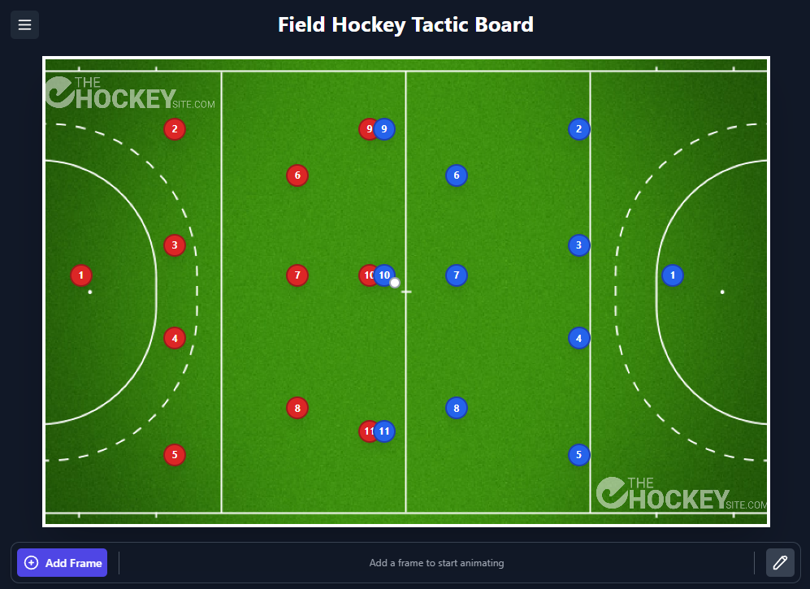

# Field Hockey Tactic Board




**The ultimate browser-based tactic board for field hockey.**

Plan plays, animate sequences, and collaborate with your team using a modern, lightweight interface. Now featuring an **AI Command Assistant** powered by Gemini to generate tactics from natural language.

## ✨ Features

- **Interactive Pitch**: Draw passes, dribbles, and zones on a resizable field.
- **AI Assistant**: Describe a play (e.g., "Setup a 5v5 drill") and watch it appear instantly.
- **Animation**: Record and playback tactical sequences with speed control.
- **Drag & Drop**: Intuitive player and ball positioning.
- **Save & Share**: Export tactics to JSON or save locally.

## 🚀 Quick Start

Get up and running in seconds.

### Prerequisites
- Node.js 18+
- npm, yarn, or pnpm

### Development

```bash
git clone https://github.com/dneimke/field-hockey-tactic-board.git
cd field-hockey-tactic-board
npm install
npm run dev
```

Open `http://localhost:5173` to view the app.

### 🤖 AI Features Setup (Optional)

To enable the AI Command Assistant:

1.  Set up a Firebase project with Cloud Functions.
2.  Set the `GEMINI_API_KEY` secret:
    ```bash
    firebase functions:secrets:set GEMINI_API_KEY
    ```
3.  Deploy functions or run locally with the Firebase Emulator.

## 📦 Deployment

To deploy to Firebase Hosting:

```bash
npm run build
firebase deploy
```

## 🛠️ Tech Stack

- **Frontend**: React 19, TypeScript, Vite, Tailwind CSS
- **Backend**: Firebase Functions (Node.js)
- **AI**: Google Gemini 2.0 Flash

## 🤝 Contributing

Contributions are welcome! Please open an issue or submit a PR.

## 📄 License

MIT © [Darren Neimke](https://github.com/dneimke)
