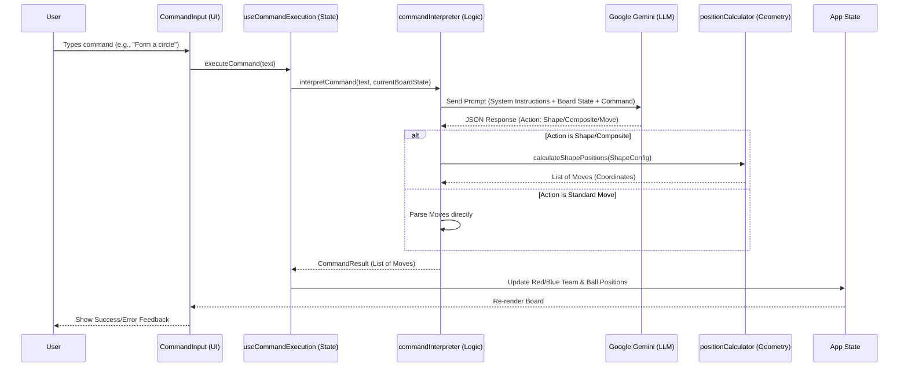

# AI Request/Response Pipeline

This document outlines the end-to-end flow of the AI Command feature, detailing how natural language requests are transformed into player movements on the board.

## Architecture Overview

The pipeline consists of four main layers:
1.  **UI Layer** (`CommandInput.tsx`): Handles user input and feedback.
2.  **State Layer** (`useCommandExecution.ts`): Manages the execution lifecycle and application state updates.
3.  **Logic Layer** (`commandInterpreter.ts`): Interfaces with the LLM (Gemini) and parses the response.
4.  **Geometry Layer** (`positionCalculator.ts`): Calculates precise coordinates for shapes and formations.

## Data Flow Diagram



## Component Details

### 1. UI Layer (`CommandInput.tsx`)
- **Responsibility**: Captures user input, displays loading states, and shows error/success messages.
- **Key Props**: `onExecute`, `isLoading`, `error`, `lastExplanation`.

### 2. State Layer (`useCommandExecution.ts`)
- **Responsibility**: 
    - Orchestrates the async execution flow.
    - Handles errors and loading states.
    - Updates the React state (Red Team, Blue Team, Ball) via `onPieceMove`.
    - Optionally adds a new animation frame after execution.

### 3. Logic Layer (`commandInterpreter.ts`)
- **Responsibility**: 
    - Constructs the System Prompt.
    - Calls the Google Generative AI API.
    - Validates the AI response (JSON parsing, schema validation).
    - Handles different action types:
        - `move`: Direct coordinate updates.
        - `shape`: Geometric shape generation.
        - `composite`: Complex multi-part requests.

### 4. Geometry Layer (`positionCalculator.ts`)
- **Responsibility**: 
    - Provides mathematical functions for calculating positions.
    - **`calculateShapePositions`**: Generates coordinates for:
        - `circle`: Uses trigonometry (sin/cos) to place players.
        - `line`: Linear interpolation between start and end points.
        - `grid`: Row/Column layout logic.

## AI Protocol (System Prompt)

The AI is instructed to return a strict JSON response. It does not calculate complex geometry itself; instead, it delegates this to the "Shape Engine" by returning a `shape` configuration.

### Response Formats

#### Option A: Standard Moves
Used for simple, direct movements.
```json
{
  "action": "move",
  "moves": [
    { "targetId": "R1", "newPosition": { "x": 50, "y": 50 } }
  ]
}
```

#### Option B: Geometric Shapes
Used when the user requests a specific arrangement. The AI specifies *what* to form, and the code calculates *where*.
```json
{
  "action": "shape",
  "shape": {
    "type": "circle",
    "center": { "x": 50, "y": 50 },
    "radius": 25,
    "players": ["R1", "B1", "R2", "B2"] // Order determines pattern
  }
}
```

#### Option C: Composite Actions
Used for complex scenarios involving multiple groups or specific individual placements.
```json
{
  "action": "composite",
  "shapes": [
    { "type": "grid", "center": { "x": 25, "y": 50 }, "players": [...] }
  ],
  "moves": [
    { "targetId": "GK_R", "newPosition": { "x": 5, "y": 50 } }
  ]
}
```

## Future Maintenance

- **Adding New Shapes**: 
    1. Update `ShapeConfig` in `positionCalculator.ts`.
    2. Implement the math in `calculateShapePositions`.
    3. Update the System Prompt in `commandInterpreter.ts` to inform the AI of the new capability.
- **Improving Accuracy**: 
    - Refine the System Prompt examples.
    - Add more context to the `BoardState` sent to the AI (e.g., field zones).
