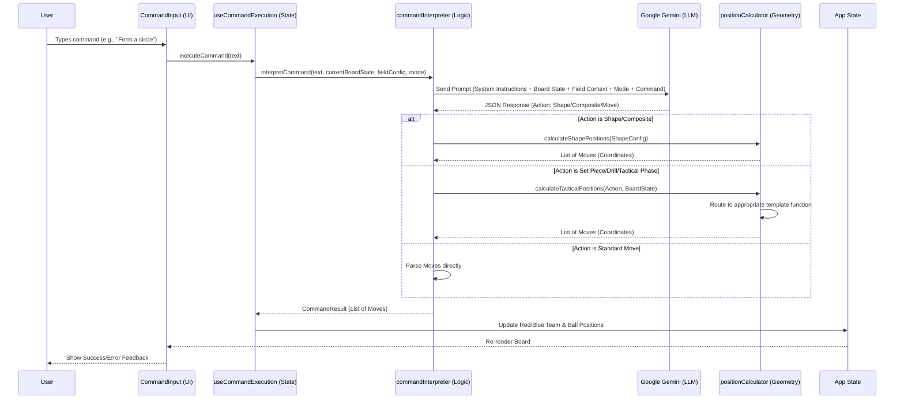

# AI Request/Response Pipeline

This document outlines the end-to-end flow of the AI Command feature, detailing how natural language requests are transformed into player movements on the board.

## Architecture Overview

The pipeline consists of four main layers:
1.  **UI Layer** (`CommandInput.tsx`, `PlayerManagement.tsx`): Handles user input, feedback, and player management controls.
2.  **State Layer** (`useCommandExecution.ts`): Manages the execution lifecycle and application state updates.
3.  **Logic Layer** (`commandInterpreter.ts`): Interfaces with the LLM (Gemini) and parses the response.
4.  **Geometry Layer** (`positionCalculator.ts`): Calculates precise coordinates for shapes and formations.

## Data Flow Diagram



## Component Details

### 1. UI Layer (`CommandInput.tsx`, `PlayerManagement.tsx`)
- **CommandInput**: Captures user input, displays loading states, and shows error/success messages.
  - **Key Props**: `onExecute`, `isLoading`, `error`, `lastExplanation`.
- **PlayerManagement**: Manages game/training mode switching and player count controls.
  - **Key Props**: `mode`, `onModeChange`, `redTeam`, `blueTeam`, `onAddPlayer`, `onRemovePlayer`.

### 2. State Layer (`useCommandExecution.ts`)
- **Responsibility**: 
    - Orchestrates the async execution flow.
    - Handles errors and loading states.
    - Updates the React state (Red Team, Blue Team, Ball) via `onPieceMove`.
    - Optionally adds a new animation frame after execution.
    - Passes field configuration and mode context to the interpreter.

### 3. Logic Layer (`commandInterpreter.ts`)
- **Responsibility**: 
    - Constructs the System Prompt with context-aware information.
    - Incorporates field type context (standard vs circle detail view).
    - Incorporates mode context (game vs training mode).
    - Calls the Google Generative AI API.
    - Validates the AI response (JSON parsing, schema validation).
    - Handles different action types:
        - `move`: Direct coordinate updates.
        - `shape`: Geometric shape generation.
        - `composite`: Complex multi-part requests.

### 4. Geometry Layer (`positionCalculator.ts`, `tacticalTemplates.ts`)
- **Responsibility**: 
    - Provides mathematical functions for calculating positions.
    - **`calculateShapePositions`**: Generates coordinates for:
        - `circle`: Uses trigonometry (sin/cos) to place players.
        - `line`: Linear interpolation between start and end points.
        - `grid`: Row/Column layout logic.
    - **`calculateTacticalPositions`**: Routes tactical actions to appropriate template functions:
        - **Set Pieces**: Penalty corners (APC/DPC) and shootouts
        - **Drills**: Small-sided games and possession drills
        - **Tactical Phases**: Outletting and pressing structures
- **Tactical Templates** (`tacticalTemplates.ts`):
    - **Outlet Functions**: `getOutletPositions` - Calculates positions for outlet structures (Back 4, Back 3, Three High, etc.)
    - **Press Functions**: `getPressPositions` - Calculates positions for pressing structures (Full Court, Half Court, W-Press, etc.)
    - **Shootout Function**: `getShootoutPositions` - Sets up shootout with isolation rules

## AI Protocol (System Prompt)

The AI is instructed to return a strict JSON response. It does not calculate complex geometry itself; instead, it delegates this to the "Shape Engine" by returning a `shape` configuration.

### Response Formats

#### Option A: Standard Moves
Used for simple, direct movements.
```json
{
  "action": "move",
  "moves": [
    { "targetId": "R1", "newPosition": { "x": 50, "y": 50 } }
  ]
}
```

#### Option B: Geometric Shapes
Used when the user requests a specific arrangement. The AI specifies *what* to form, and the code calculates *where*.
```json
{
  "action": "shape",
  "shape": {
    "type": "circle",
    "center": { "x": 50, "y": 50 },
    "radius": 25,
    "players": ["R1", "B1", "R2", "B2"] // Order determines pattern
  }
}
```

#### Option C: Composite Actions
Used for complex scenarios involving multiple groups or specific individual placements.
```json
{
  "action": "composite",
  "shapes": [
    { "type": "grid", "center": { "x": 25, "y": 50 }, "players": [...] }
  ],
  "moves": [
    { "targetId": "GK_R", "newPosition": { "x": 5, "y": 50 } }
  ]
}
```

#### Option D: Set Pieces
Used for penalty corners and shootouts.
```json
{
  "action": "set_piece",
  "type": "APC" | "DPC" | "shootout",
  "parameters": {
    // APC: batteries, injectorSide, injectorId, battery1Type
    // DPC: defenseStructure, runnerCount
    // Shootout: attackerId, gkId
  },
  "explanation": "Setting up tactical scenario"
}
```

#### Option E: Drills
Used for training drills and small-sided games.
```json
{
  "action": "drill",
  "type": "small_sided_game" | "possession",
  "parameters": {
    "attackers": 4,
    "defenders": 3,
    "withGK": true,
    "zone": "attacking_25" | "midfield" | "defensive_circle" | "full_field"
  },
  "explanation": "Setting up training drill"
}
```

#### Option F: Tactical Phases
Used for outletting and pressing structures.
```json
{
  "action": "tactical_phase",
  "type": "outlet" | "press",
  "team": "red" | "blue",
  "structure": "back_4" | "full_court" | "w_press" | ...,
  "intensity": 80,  // Optional: 0-100 for press height
  "explanation": "Setting up tactical structure"
}
```

## Prompting Strategy

The system uses a structured, context-rich prompting approach to ensure accurate command interpretation. The prompt is dynamically constructed in `commandInterpreter.ts` using the `createPrompt` function.

### Prompt Structure

The prompt is organized into distinct sections that provide comprehensive context:

1. **Field Layout & Coordinate System**
   - Explains the percentage-based coordinate system (0-100 for both axes)
   - Defines field zones (Defensive third, Midfield, Attacking third)
   - Maps X/Y axes to field orientation (X: left goal to right goal, Y: top to bottom)

2. **Field Glossary**
   - Provides domain-specific terminology:
     - "Shooting Circle" or "D": Semi-circle ~15m from goal
     - "23m Area" or "25yd Area": Zone between backline and 23m line
     - "Midfield": Central area between the two 23m lines
   - Helps the AI understand tactical references in user commands

3. **Current Board State**
   - Lists all Red Team players with IDs, numbers, and current positions
   - Lists all Blue Team players with IDs, numbers, and current positions
   - Includes ball position(s) with IDs
   - Enables the AI to make context-aware decisions based on current setup

4. **Available Formations**
   - Lists supported formations (4-3-3, 4-4-2, 3-5-2, 3-4-3, 5-3-2)
   - Helps when users request specific tactical formations

5. **Command to Interpret**
   - The user's natural language input is embedded directly in the prompt

6. **Instructions & Response Formats**
   - Clear step-by-step instructions for the AI
   - Six distinct response format options (Standard Moves, Geometric Shapes, Composite, Set Pieces, Drills, Tactical Phases)
   - Each format includes detailed schema with required/optional fields

7. **Field View Context** (NEW)
   - Current field type (standard or circle detail)
   - Field-specific guidance (e.g., circle detail view emphasizes shooting circles)
   - Helps AI understand visual context and positioning priorities

8. **Mode Context** (NEW)
   - Game Mode: Fixed 11 players per team, standard formations
   - Training Mode: Variable player counts, only reference existing players
   - Player count awareness in board state listings
   - Goalkeeper identification ([GK] labels in player listings)

9. **Training vs Game Mode** (Enhanced)
   - Distinguishes between match scenarios (single ball) and training drills (multiple balls)
   - Provides rules for ball ID usage (`ball` vs `ball_2`, `ball_3`, etc.)
   - Handles reset behavior differently based on mode
   - Variable player count awareness in training mode

10. **Examples**
   - Concrete examples showing:
     - Simple moves ("Move red player 7 to center")
     - Shape formation ("Form a circle with all players")
     - Complex composite actions ("Setup 5v5 training drill")
     - Set pieces ("Setup a 2-castle PC attack", "Shootout for R10")
     - Drills ("4v2 game in the D")
     - Tactical phases ("Red team outlet using a Back 3", "Blue team setup a Half Court press")
     - Reset scenarios ("Reset to match start")
   - Demonstrates expected JSON structure for each scenario

11. **Constraints & Validation Rules**
   - Position bounds (0-100 for both x and y)
   - Player ID requirements (must exist in current state, especially important in training mode)
   - Overlap avoidance guidance
   - JSON-only response requirement (no markdown, no extra text)
   - Spatial awareness reminders (goalkeeper positions, field zones)
   - Goalkeeper visual distinction awareness (GK label, different color)

### Design Principles

- **Context-Rich**: Provides all necessary information in a single prompt to avoid ambiguity
- **Structured Output**: Enforces strict JSON schema to ensure parseable responses
- **Example-Driven**: Uses concrete examples to guide the AI toward correct behavior
- **Domain-Aware**: Includes field hockey terminology and tactical knowledge
- **Mode-Aware**: Distinguishes between game and training scenarios with variable player counts
- **Field-Aware**: Adapts guidance based on current field view type
- **Goalkeeper-Aware**: Recognizes and preserves goalkeeper special status
- **Validation-First**: Emphasizes constraints upfront to prevent invalid responses

### Response Parsing

After receiving the AI response, the system:
1. Extracts JSON from markdown code blocks (if present)
2. Parses the JSON structure
3. Validates the response against expected schemas
4. Handles shape/composite actions by delegating to the geometry layer
5. Resolves player overlaps automatically
6. Validates all positions and target IDs before execution

This multi-layered validation ensures robust error handling and prevents invalid states from reaching the UI.

## Mode-Aware Processing

The system now supports two distinct modes that affect how commands are interpreted:

### Game Mode
- **Fixed Player Count**: Always 11 players per team
- **Standard Formations**: Full support for standard formations (4-3-3, 4-4-2, etc.)
- **Goalkeeper Handling**: Goalkeepers are identified by `isGoalkeeper: true` flag and displayed with "GK" label and distinct color
- **Single Ball**: Typically one ball on the field

### Training Mode
- **Variable Player Counts**: Teams can have any number of players (including 0)
- **Flexible Formations**: AI must work with whatever players exist in the current state
- **Player ID Awareness**: AI is explicitly warned to only reference players that exist
- **Multiple Balls**: Can place multiple balls for drill scenarios
- **Dynamic Player Management**: Users can add/remove players via UI controls

The AI prompt dynamically adjusts based on the current mode, providing appropriate context and constraints.

**Automatic Mode Switching:**
The system automatically switches modes based on command action type:
- **Drill commands** (`action: 'drill'`) → Automatically switches to Training Mode
- **Tactical commands** (`action: 'set_piece'` or `action: 'tactical_phase'`) → Automatically switches to Game Mode
- **Saved tactic loads** → Keeps current mode (does not force mode change)
- Users can manually override mode via toolbar toggle at any time

This ensures drills are executed in the appropriate mode (training) and tactical scenarios use game mode, improving the user experience by reducing manual mode switching.

## Field Type Context

The system supports multiple field diagram views:

### Standard Field View
- Full field view showing complete pitch
- All positions (0-100) are visible and valid
- Best for general tactics and formations

### Circle Detail View
- Emphasizes shooting circles (D areas)
- Focuses on penalty corner and circle tactics
- AI is instructed to prioritize circle area positioning (x: 0-15 for left, x: 85-100 for right)
- All coordinates remain valid, but positioning guidance adapts

The field type is included in the AI prompt to provide context-aware positioning guidance.

## Tactical Phase Flow

The system now supports three types of tactical phases that extend the template engine:

### Outletting Structures
- **Purpose**: Visualize standard defensive structures used to break a press
- **Structures**: Back 4 (dish), Back 3 (cup), Three High, Asymmetric Right/Left
- **Flow**:
  1. AI recognizes outlet command and structure name
  2. Returns `TacticalPhaseAction` with type `outlet`
  3. `calculateTacticalPositions` routes to `getOutletPositions`
  4. Template function calculates positions based on structure pattern
  5. Positions are mirrored for blue team automatically

### Pressing Structures
- **Purpose**: Set entire team defensive structures with a single command
- **Structures**: Full Court, Half Court, W-Press, Split Vision
- **Flow**:
  1. AI recognizes press command and structure name
  2. Returns `TacticalPhaseAction` with type `press` and optional intensity
  3. `calculateTacticalPositions` routes to `getPressPositions`
  4. Template function calculates positions, adjusting for intensity if provided
  5. Positions are mirrored for blue team automatically

### Shootout
- **Purpose**: Visualize FIH 8-second shootout setup
- **Flow**:
  1. AI recognizes shootout command and identifies attacker/GK
  2. Returns `SetPieceAction` with type `shootout`
  3. `calculateTacticalPositions` routes to `getShootoutPositions`
  4. Function places attacker at 23m line, GK on goal line
  5. All other players moved behind center line for isolation
  6. Validates no non-active players in 23m area

## Future Maintenance

- **Adding New Shapes**: 
    1. Update `ShapeConfig` in `positionCalculator.ts`.
    2. Implement the math in `calculateShapePositions`.
    3. Update the System Prompt in `commandInterpreter.ts` to inform the AI of the new capability.
- **Adding New Tactical Structures**:
    1. Add structure to appropriate pattern map (`OUTLET_PATTERNS` or `PRESS_PATTERNS`) in `tacticalTemplates.ts`.
    2. Implement calculation function with team orientation handling.
    3. Update System Prompt in `commandInterpreter.ts` with new structure name and example.
    4. Add example command to `PromptHelp.tsx`.
- **Adding New Field Types**:
    1. Add new field type to `FieldType` in `types.ts`.
    2. Add configuration to `FIELD_CONFIGS` in `fieldConfig.ts`.
    3. Update prompt guidance in `commandInterpreter.ts` if coordinate system differs.
- **Improving Accuracy**: 
    - Refine the System Prompt examples.
    - Add more context to the `BoardState` sent to the AI (e.g., field zones).
    - Enhance mode-specific examples in prompts.
    - Add more tactical structure variations and coordinate refinements.
